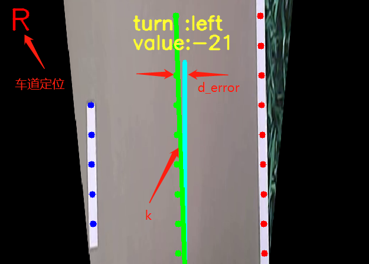

# Line dectection using  HSV color extraction and slide windows method (python)

# Configuration
1.Python3.5 ,opencv-python,pyqt5 and yaml are necessary
```
pip install -i https://pypi.tuna.tsinghua.edu.cn/simple opencv-python 
```

# Usage
0.Download the project. It may take a little time, because the project contains a few minutes of video dataset.
```
git clone https://github.com/zj611/line_dect_and_localization.git
```
1.Run the project
```
python main0.py
```
2.[]

3.The following image shows our system's infrastructure.The communication scheme adopts Socket programming based on UDP protocol.
 
 
 
# Other additional functions
1.You can assign the speed value by pressing the keyboard 1~9, and `(on the left side of '1') is stopping command.

2.You can assign the lane (left or right) by pressing the key 'q' or 'w'.

3.You can choose whether to turn off yellow detection by pressing the key 'e'.

4.The VideoCapture.py can be used for recording video dataset.
```
python VideoCapture.py your_video_name
```
